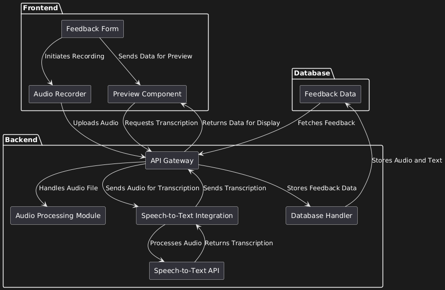
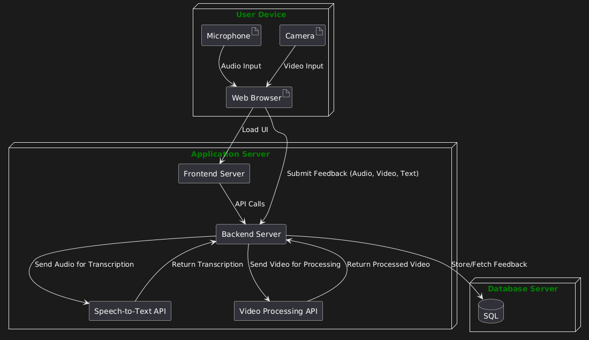
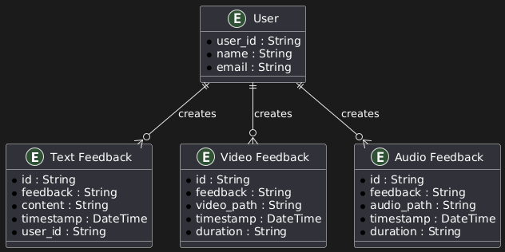

# System Design Document (Techical Design) [v3.1]

---

## 1. Introduction

### 1.1 Project Description
The project focuses on developing **text and voice feedback** features with optional **voice recognition** for the company **Scorion**. Scorion develops a student portfolio system that aims to provide feedback not only for final grading but for smaller parts of each task (data points). This data point approach offers students a fuller picture of their progress, making feedback a **primary focus**.

### 1.2 Objectives
Currently, Scorion relies on external systems (e.g., sending forms or using mobile device speech recognition) for feedback. This project aims to **reduce dependence on third-party services** and build a set of feedback features in-house. As a proof of concept, the new features will be developed separately from the existing software.

Objectives:

- Provide a **voice feedback** feature that allows recordings to be stored.
- Provide a **text input** feature that allows users to type and store feedback.
- Include a **voice-to-text** conversion for audio feedback using **Whisper** from HuggingFace.
- Preserve confidentiality by **avoiding** the use of **third-party services**.
- Optionally explore a **video feedback** feature for future enhancement.

### 1.3 Scope
This document focuses on the **technical design** of the system, covering architectural decisions, frameworks, components, and how they fulfill the client’s requirements.

### 1.4 Stakeholders
- **Client**: Scorion, formulating the system requirements.  
- **Lecturer**: Eelco Jannink, who sets guidelines for frameworks and acts as intermediary to the client.

---

## 2. General Overview and Approach

When making technical decisions, the project team prioritizes:

- **Client Requirements**: Ensuring the system meets the needs and constraints set by Scorion.
- **Modularity & Reusability**: Building components that can be reused or replaced with minimal effort.
- **Independence of Frontend & Backend**: Allowing the system to be extended or maintained without introducing system-wide dependencies.
- **Maintainability & Extendibility**: Ensuring the chosen frameworks allow for future expansions and easy updates.

---

**Framework Choices**:

1. **Frontend**: [Svelte](https://svelte.dev/) for its simplicity, performance, and small footprint.  
2. **Backend**: [Node.js](https://nodejs.org/) with [Express.js](https://expressjs.com/) for easy routing and API creation.  
3. **Database**: [SQLite](https://www.sqlite.org/) for a lightweight, file-based database approach.


## 3. Design Considerations

### 3.1 Frontend
- **Framework**: Svelte
- **Component Design**:
  - Must be modular, reusable, and maintainable.
  - Scoped or global styling as appropriate.
- **User Experience**:
  - Simplicity and accessibility are paramount.
  - Clear feedback forms and intuitive recording controls.

### 3.2 Backend
- **Architecture**: Node.js with Express.js
- **Modules**:
  - **Audio Processing**: Handle file compression, encryption, and storage.
  - **Voice-to-Text**: Integrate [Whisper](https://openai.com/index/whisper/) from HuggingFace locally for transcription.
- **Scalability**:
  - Keep modules decoupled to allow adding new features (like video feedback) in the future.

---

## 4. System Architecture

### 4.1 Logical View (Functional Components)



1. **Frontend Components**  
   - **Feedback Form**: Main interface for users to record audio, preview feedback, and submit forms.  
   - **Audio Recorder**: Captures audio from the user’s microphone and sends it to the backend.  
   - **Preview Component**: Displays recorded audio and transcribed text to the user.

2. **Backend Components**  
   - **API Gateway**: Manages all HTTP requests/responses between frontend and backend.  
   - **Audio Processing Module**: Compresses and encrypts audio files, prepares them for storage.  
   - **Speech-to-Text Integration**: Calls local Whisper API for transcription.  
   - **Database Module**: Stores feedback entries (text, audio, video) in SQLite.

3. **Database**  
   - **Feedback Data**: Stores all feedback records (audio files, text, optional video) securely.

---

### 4.2 Hardware Architecture (Deploy)



1. **User Device**  
   - A desktop, laptop, or mobile device with a **microphone** for audio and a **camera** for video recording (optional).
   - A modern **web browser** for accessing the Svelte frontend.

2. **Application Server**  
   - **Frontend Server**: Hosts static Svelte files.  
   - **Backend Server**: Handles API requests, processes media files, connects to the database, and integrates with the Whisper engine.  
   - **Speech-to-Text API**: Local instance of Whisper.  
   - **(Optional) Video Processing API**: For handling video compression and storage in the future.

3. **Database Server**  
   - **SQLite**: A file-based database located on the same or a dedicated server. Stores user feedback, including audio paths, text content, and (optional) video paths.

---

### 4.3 Software Architecture

#### 4.3.1 Overview
- **Frontend**: Svelte  
- **Backend**: Node.js + Express.js  
- **Database**: SQLite  

#### 4.3.2 Libraries & APIs
- **MediaStream API**: For in-browser audio recording and playback.  
- **MediaRecorder API**: Provides video and audio recording capabilities in the browser.  
- **Whisper API (HuggingFace)**: Local speech-to-text processing.  
- **Svelte-simple-modal**: Pop-up dialogs (confirmation, editing feedback, etc.).  
- **Font Awesome**: Icon library for consistent visual elements.

#### 4.3.3 Protocols
- **HTTP/HTTPS** for all frontend-backend communication.
- **RESTful API** for standard CRUD operations on feedback data.

#### Components

1. **FeedbackButton**:
- Supports icons, labels, and actions on press.
- Customizable colors for different contexts (e.g., Record, Stop, Play, Send).

2. **List**:
- Displays a list of items (e.g., feedback list).

3. **TitleInputField**:
- Allow user to edit or fill in texts.

4. **AlertModal**
- Shows confirmation or errors.

5. **AudioRecorder**
- Handles audio recording and accessibility to microphone.

6. **FeedbackModal**
- Displays a pop-up when click on Add a new feedback.
- Show tabs that provide option for user to choose which type of feedback to add.

7. **FeedbackModalContent**
- Basically the design for the Add new feedback button.

8. **FeedbackTabs**
- Shows tabs of feedback type being listed.
- Allow users to preview any feedbacks in the database.
- Handle real-time transcription.

9. **NameInputModal**
- A pop-up that appears when user save a new feedback that allows them to name the feedback they just added.

10. **TextRecorder**
- Handles text feedback.
- Allows user to type in text feedbacks.

11. **ThemeSwitch**
- Allows user to switch between dark, light and high contrast theme.

12. **TranscriptionDisplay**
- Display real-time transcriptions from audio or video feedbacks.

13. **VideoRecorder**
- Handles video recording and accessibility to camera/webcam.

### APIs

- **MediaStream API**: Handles audio recording and playback.
- **Whisper API** (HuggingFace): Provides local speech-to-text functionality.
- **MediaRecorder API**: Provides camera recorder and enables the recording of media stream.

### 4.4 Information Architecture



1. **Entities**  
   - **TextFeedback**: Stores text-based feedback.  
   - **AudioFeedback**: Stores metadata (file path, timestamps) for audio feedback.  
   - **VideoFeedback**: Stores metadata for video feedback (file path, duration).  
   - **User**: Identifies the creator of feedback.

2. **Relationships**  
   - A **User** can create multiple **feedback** records (text/audio/video).  

3. **Data Types**  
   - Text: Raw textual feedback  
   - Audio: Typically `.wav` or `.mp3`  
   - Video: Potential `.mp4` or `.webm`

4. **Navigation**  
   - Frontend routes and lists allow selecting and viewing existing feedback.  
   - Feedback is displayed in chronological order with a quick preview (audio/video player or text snippet).

---

### 4.5 Security Architecture
- **Local Processing**: Whisper runs locally (or on a private server) to avoid sending audio to third-party servers.  
- **Encryption**: Audio files can be encrypted at rest in SQLite or on the file system.  
- **Confidentiality**: All interactions remain internal, fulfilling client’s privacy requirements.  
- **ISO27001**: Security best practices for handling personal data are considered to ensure compliance with relevant standards.

---

### 4.6 Performance
- **Whisper Model**:
  - **Tiny/Base**: Faster, smaller (1–2GB VRAM). Suitable for near real-time transcription with moderate accuracy.  
  - **Medium/Large**: More accurate but requires >10GB VRAM. Slower, typically used for batch processing or high-quality offline tasks.  
- **Latency**: Minimizing lag for audio playback and transcription start/stop events.  
- **GPU Acceleration**: Speeds up Whisper significantly if a GPU is available.  
- **Scalability**: Node.js handles concurrent requests well; scaling horizontally is feasible with multiple server instances.

---

## 5. System Design


### Database Design

- **Database**: SQLite is used to store recordings and textual feedback.
- **Reasoning**:
    - Ease of integration and maintenance.
    - File-based storage for enhanced security.

### User Interface Design

#### First sketches of the wireframes 


From technical perspective, not user perspective. 
- **Principles**:
    - Focus on simplicity and intuitiveness.
    - Clear labeling and purposeful placement of buttons.
- **UI Elements**:
    - Lists for displaying saved feedback.
    - Buttons for audio actions (Record, Play, Pause, Stop).


### Software Design

- Modular and extendable backend structure.
- Reusable Svelte components for the frontend.
- Frameworks and libraries.
- Mobile responsiveness.

### Security Design

- Local data processing and storage to align with privacy requirements.
- ISO27001 compliance for system security.

---

## 6. Data Flow


### Audio/Video Recording and Transcription
1. Users clicks on the record button to start audio or camera capture.
2. Audio or video is recorded and temporarily stored in the browser.
3. On saving, audio or video file will be sent to backend for storage and real-time transcription via Whisper API.
4. Transcripted text is returned to the frontend for users to edit and submit

### Feedback Submission
1. Users can preview and edit text/audio/video with transcriptions.
2. On submitting, the files will be sent to backend for validation and storage in the database.

---

## 7. Data Model

### Feedback Models

```
text_feedback
{
 "id": "id", 
 "feedback": "name",
 "content": "feedback_text",
 "timestamp": "created_at",
 "user_id": "user_id"
 }
```

```
video_feedback
{
 "id": "id", 
 "feedback": "name",
 "video_path": "file_path",
 "timestamp": "created_at",
 "duration": "duration"
 }
```

```
audio_feedback
{
 "id": "id", 
 "feedback": "name",
 "audio_path": "file_path",
 "timestamp": "created_at",
 "duration": "duration"
 }
```
---

## 8. Error Handling

### Frontend

1. Display error messages for failed recordings or API requests.
2. Display error when new feedback is empty.
3. Display error when feedback name is empty while saving.
4. Handle UI fallback for users without microphone or camera access.

### Backend

1. Validate input files and texts before processing.
2. Return understandable errors code.

Example response

```
{
  "status": "error",
  "code": "E001",
  "message": "Invalid input data",
  "details": {
    "field": "feedback",
    "error": "Field is required"
  }
}
```

---

## 9. Timeline

### Sprint 1: Research and wireframes.
  - Develop an audio recording functionality.
  - Add Play, Pause, and Stop buttons for the recording feature.
  - Implement secure storage for audio files in the database.
  - Display a list of previously recorded audios.
  - Provide a Play button next to each audio file in the list.
  - Ensure smooth playback functionality for recorded audio.
  - Implement a text input field for entering feedback.
  - Add a Save button to store the feedback.
  - Ensure text feedback is stored securely in the database.
  - Create a list view for displaying previously saved text feedback.
  - Include a preview box where users can read selected text feedback.

### Sprint 2: Implement core functions (recording, transcription).
  - Integrate Whisper into the backend to process stored audio files.
  - Convert recorded audio files to the required frequency (16,000 Hz).
  - Add a "Transcribe" button to audio feedback previews for initiating transcription.
  - Connect the transcription feature between the frontend and backend.
  - Add a theme switcher to the frontend with options for Light, Dark, and High Contrast modes.
  - Implement the Light theme, ensuring consistent styling and smooth transitions.
  - Add High Contrast mode to both Light and Dark themes for better accessibility.

### Sprint 3: Finalize features, fix bugs, mobile responsive and testing.
  - Create a video recorder component with buttons for record, stop, and playback.
  - Add database functionality for video storage and retrieval.
  - Display a list of recorded videos with options for playback.
  - Investigate and implement real-time status updates for the transcription process.
  - Display progress stages like uploading, conversion, and transcription on the frontend.
  - Move feedback lists (audio, text, video) to a separate page.
  - Add a slider to toggle between different feedback types.
  - Improve the visual design of the interface, including consistent styling and clear labels.

---

## 10. Changelog

| Version | Date       | Author | Description                                  |
|---------|------------|--------|----------------------------------------------|
| 1.0     | 2024-11-20 | Team   | Initial draft based on the project scope and objectives. |
| 2.0     | 2024-12-08 | Din    | Updated to include Sprint 1 progress.        |
| 2.5     | 2025-10-01 | Andre  | Updated                                      |
| 3.0     | 2025-16-01 | Andre  | Updated and make final for submission        |
| 3.1     | 2025-16-01 | Din    | Final revision                               |

---

## 11. Appendix

1. Svelte documentation https://svelte.dev/docs/svelte/overview.
2. Svelte modal library https://github.com/flekschas/svelte-simple-modal.
3. MediaRecorder documentation https://developer.mozilla.org/en-US/docs/Web/API/MediaRecorder.
4. WebRTC API documentation https://developer.mozilla.org/en-US/docs/Web/API/WebRTC_API.
5. Using the MediaStream Web API to record screen, camera and audio https://dev.to/antopiras89/using-the-mediastream-web-api-to-record-screen-camera-and-audio-1c4n.
6. Wireframes versions https://www.figma.com/design/BHSrZGE8qXKYVjlXcGILRR/Wireframe?node-id=0-1&p=f&t=tiixB8LcRDDnNiLi-0.
7. Introducing Whisper https://openai.com/index/whisper/.
8. Icons library https://fontawesome.com/icons.